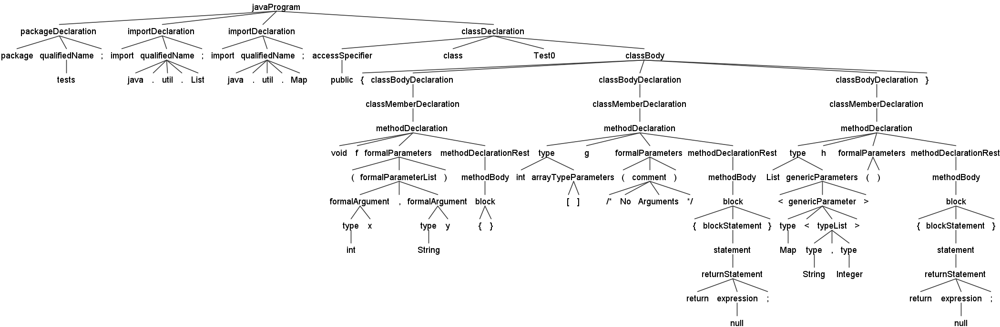

# Translate Java Classes to Java Interfaces

In this exampe, we have to translate java classes to java interfaces while conserving the spaces and comments.

## Parse Tree



## Output

```java
interface ITest0 {
        void f(intx,Stringy);
        int[] g(/*NoArguments*/);
        List<Map<String,Integer>> h();
}
```
